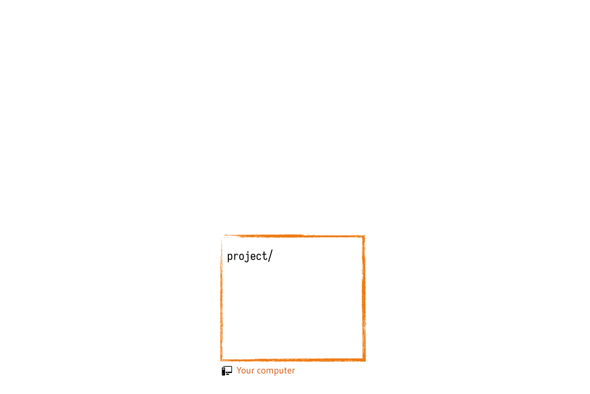
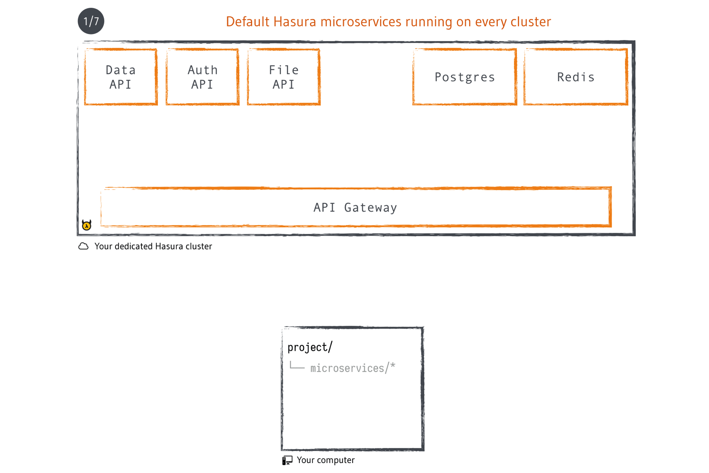

# simple-go-server

A simple golang web server with basic logging, tracing, health check, graceful shutdown and zero dependencies. This project is based on a [GitHub gist](https://gist.github.com/enricofoltran/10b4a980cd07cb02836f70a4ab3e72d7) by [enricofoltran](https://github.com/enricofoltran), featured on [HackerNews](https://news.ycombinator.com/item?id=16090977) which was later moved to [enricofoltran/simple-go-server](https://github.com/enricofoltran/simple-go-server). Hasura adds git push to deploy, free hosting and a free domain name with SSL for the server.

<!-- markdown-toc start - Don't edit this section. Run M-x markdown-toc-refresh-toc -->
**Table of Contents**

- [Getting started](#getting-started)
  - [Prerequisites](#prerequisites)
  - [Quickstart](#quickstart)
- [Making changes to code](#making-changes-to-code)
  - [Directory structure](#directory-structure)
  - [Edit](#edit)
  - [Deploy](#deploy)
  - [Debug](#debug)
- [Local development](#local-development)
  - [With Docker](#with-docker)
  - [Without Docker](#without-docker)
- [Under the hood](#under-the-hood)

<!-- markdown-toc end -->

## Getting started

### Prerequisites

- [Hasura CLI](https://docs.hasura.io/0.15/manual/install-hasura-cli.html)
- [Git](https://git-scm.com/)
- [Docker](https://docs.docker.com/engine/installation/) or [Golang](https://golang.org/doc/install) (only for local development)

### Quickstart

```bash
# quickstart from this boilerplate
$ hasura quickstart shahidhk/simple-go-server

# git push to deploy
$ cd simple-go-server
$ git add . && git commit -m "First commit"
$ git push hasura master
```

Once deployed, access the app using the following command:

```bash
# open the gin app url in a browser
$ hasura microservice open app
```

## Making changes to code

### Directory structure

```bash
.
├── Dockerfile             # instructions to build the image
├── k8s.yaml               # defines how the app is deployed
└── src
    └── main.go            # go source code

```

### Edit

Edit the code in `src/main.go`:

```bash
$ cd microservices/app
$ vim src/main.go
```

### Deploy

Commit and push to deploy again:

```bash
$ git add src/main.go
$ git commit -m "made changes"
$ git push hasura master

```

Checkout the changes:

```bash
# open the url in browser
$ hasura microservice open app
```

### Debug

If the push fails with an error `Updating deployment failed`, or the URL is showing `502 Bad Gateway`/`504 Gateway Timeout`, follow the instruction on the page and checkout the logs to see what is going wrong with the microservice:

```bash
# see status of microservice app
$ hasura microservice list

# get logs for app
$ hasura microservice logs app
```

Fix the errors and [deploy again](#deploy).

## Local development

### With Docker

- Install [Docker CE](https://docs.docker.com/engine/installation/)

```bash
# go to app directory
$ cd microservices/app

# build the docker image
$ docker build -t simple-go-server-app .

# run the image
$ docker run --rm -it -p 5000:5000 simple-go-server-app

# app will be available at http://localhost:5000
# press Ctrl+C to stop the server
```

### Without Docker

- Install [Golang](https://golang.org/doc/install)
- Move the `simple-go-server` directory to your `GOPATH` and cd into the directory

```bash
# change to app directory
$ cd mircoservices/app

# run the local server script
# windows users: run this in git bash
$ go run src/main.go

# app will be available at http://localhost:5000
# press Ctrl+C to stop the server
```

## Under the hood

Everything is declarative in a Hasura project. Your source code, configuration of clusters and database migrations are all applied and deployed in a simple `git push`.

 
 

Read more about the Hasura architecture [here](https://docs.hasura.io/0.15/manual/cluster/architecture.html).
